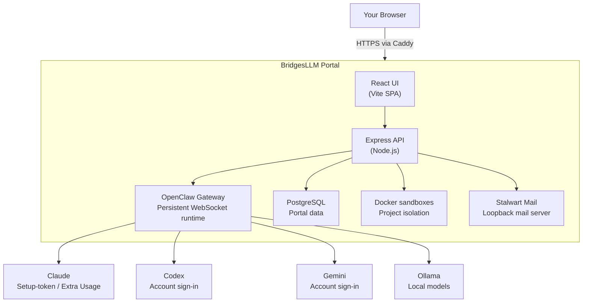

<p align="center">
  
</p>

<h1 align="center">BridgesLLM Portal</h1>

<p align="center">
  <strong>Your entire AI workflow in one self-hosted web UI. One command to install.</strong>
</p>

<p align="center">
  <a href="https://bridgesllm.ai"></a>
  <a href="https://github.com/BridgesLLM-ai/portal/releases"></a>
  <a href="https://github.com/BridgesLLM-ai/portal/blob/main/LICENSE"></a>
  <a href="https://github.com/BridgesLLM-ai/portal/stargazers"></a>
  <a href="https://x.com/BridgesLlm90984"></a>
</p>

---

BridgesLLM Portal runs on [OpenClaw](https://github.com/openclaw/openclaw) and turns a supported Ubuntu or Debian VPS into a complete browser-based AI workstation — multi-provider agent chat, sandboxed code execution, a shared browser your agent controls while you watch, remote desktop, project management, file manager, email, and more. If OpenClaw is already installed, the portal installer detects it and uses the existing installation.

**Stop bouncing between tools.** Chat with Claude, Codex, Gemini, or local models. Have your agent browse the web, write code, manage files, send email — all from one tab, on a server you own.

**One command. Five minutes.**

```bash
curl -fsSL https://bridgesllm.ai/install.sh | sudo bash
```

### Requirements

- Ubuntu 22.04+ or Debian 12+
- 3.5 GB RAM minimum (4 GB+ recommended)
- 35 GB free disk space
- Root or sudo access

### Windows test drive (WSL 2 beta)

BridgesLLM Portal is still **VPS-first**, but Windows users can now test it locally through **WSL 2** before renting a server.

**Important:** this Windows / WSL path is still **experimental, currently untested in the field, and under active development**. Treat it as a local product preview, not a production deployment target.

Use this once Ubuntu WSL is installed:

```powershell
wsl -d Ubuntu -u root -- bash -lc "curl -fsSL https://bridgesllm.ai/install.sh | bash -s -- --local"
```

Then open `http://localhost:4001` in Windows and skip domain + HTTPS in the setup wizard. Public hosting, custom domains, and internet-facing share links remain VPS features in this beta path.

See [docs/WINDOWS_WSL_BETA.md](docs/WINDOWS_WSL_BETA.md) for the full reasoning, caveats, and references.

## 📺 See It in Action

Visit [bridgesllm.ai](https://bridgesllm.ai) for live video demos of every feature.

## 🎯 What You Get

### Agent Chat
Talk to Claude, Codex, Gemini, or Ollama through the provider path that fits each one — account sign-in where supported, Claude setup-token flow, API keys, or local models. Switch models mid-conversation. Powered by [OpenClaw](https://github.com/openclaw/openclaw).

### Shared Browser
Your agent controls a real Chrome browser via CDP — navigating, clicking, filling forms, extracting data — while you watch live on the remote desktop. Ask it to research something, check a page for bugs, or automate a web workflow.

### Projects & Code Sandbox
Create projects, edit code in-browser with Monaco Editor, and assign AI agents to tasks. Each project runs in an isolated Docker container. Git integration, live preview, autonomous background agents.

### Remote Desktop
Full graphical desktop via NoVNC — accessible from any device. Run GUI apps, browser automation, or visual workflows without SSH.

### Terminal
Full xterm.js terminal in the browser. Run commands, manage packages, monitor your server — no SSH client needed.

### File Manager
Browse, upload, edit, and manage server files. Drag-and-drop, in-browser editing, archive extraction.

### Email
Built-in Stalwart mail server. Read, compose, and send email with rich HTML rendering and attachments — from your own domain.

### Automations
Schedule recurring AI tasks with cron from the browser. Monitoring, reports, maintenance — runs while you sleep.

### Skills Marketplace
Browse and install agent skills from [ClawHub](https://clawhub.ai) with one click. Configure MCP tools and extend your agent's capabilities.

### Setup Wizard
Everything configured in-browser. Domain, SSL, providers, users — no CLI expertise needed. Codex and Gemini support account sign-in, Claude uses the guided setup-token flow, and key-based providers use API keys.

### Self-Updating Dashboard
One-click updates from the browser. Admin dashboard with user management, storage monitoring, and session controls.

## 🆕 Recent Changes

### v3.25.4 (April 19, 2026)
- **Portal installs and updates now auto-apply the compatibility hotfix when needed**: the temporary OpenClaw relay and Gemini patch layer is no longer buried in Settings for normal install/update flows, so affected installs come up in the compatible state automatically.
- **Release artifacts now carry the full Gemini-aware helper**: the bundled hotfix script patches the hashed relay bundles plus the Gemini CLI/runtime compatibility markers that the validated test-box path still depends on.

### v3.25.3 (April 17, 2026)
- **Live chat-state reconciliation is finally honest**: Agent Chat and project chat now preserve pending user turns and the active assistant bubble while history reloads, delay post-turn reconciliation until the gateway catches up, and restore separate thinking, tool, text, and compaction phases on refresh instead of flattening them into stale garbage.
- **Tool activity is much clearer while a run is in flight**: the composer rail, main chat, and project chat now share tool-specific glyphs and status copy, and running tools stay visible during maintenance or compaction instead of being replaced by a fake generic thinking message.
- **Fresh OpenClaw sessions and model controls are more reliable**: `new-*` portal sessions can be materialized on demand before model patching, session-control loading states are more truthful, and model discovery now reads the live OpenClaw config instead of relying on brittle CLI scraping.
- **Projects regained richer public-safe preview coverage**: Markdown/HTML, PDF, spreadsheet, text, Monaco, and binary-file viewers are back in the public source tree, which fixes clean public builds and improves in-browser file previews.
- **Ops and release hardening kept pace**: Remote Desktop is locked tighter behind elevated auth and loopback-only websockify, Gemini account OAuth is a first-class setup path, gateway restart fallback is safer on hosts without user-systemd, and the public export script now blocks dirty trees plus beta/staging contamination before a push can happen.


### v3.25.2 (April 14, 2026)
- **OpenClaw compatibility hotfix status works again on current installs**: the portal now inspects the real hashed `heartbeat-runner-*` and `get-reply-*` bundles, recognizes the newer upstream exec-completion detector, and stops falsely calling modern OpenClaw builds unsupported when the relay hotfix can still be applied safely.
- **This patch release fixes public release parity, not just local production knowledge**: the source tree, installer artifacts, and hosted download now all ship the same compatibility behavior instead of depending on a private manual workaround, and the public source export again contains the lazy project viewer components needed for a clean frontend build.

### v3.25.1 (April 13, 2026)
- **Installer and updater users now get the OpenClaw compatibility helper fix too**: the bundled long-run relay hotfix script now resolves the real current hashed OpenClaw bundles, patches the right `get-reply` file, and keeps installer/update artifacts aligned with the live production compatibility fix instead of leaving the repair stranded in source only.
- **This is a clean patch release for distribution parity**: public GitHub source, hosted installer, and hosted tarball now all ship the same helper refresh under a proper new version instead of silently changing bits behind `3.25.0`.

### v3.25.0 (April 12, 2026)
- **Agent Chat and project chat finally act like the same product**: both surfaces now share the same status rail, project chat lost the stray inline stop button, misleading thought-process pills are gone, live run status copy is clearer, and project chat gained proper run-resume, approval, reconnect, model-persistence, and live metadata handling.
- **Auth, setup, reinstall, and password flows got a serious hardening pass**: protected deep links preserve their destination, password policy is enforced consistently across setup and recovery flows, reinstall/reset/password-change paths revoke old sessions correctly, and signed-out pollers stop hammering protected endpoints.
- **Permission boundaries are more truthful**: non-admin users no longer get unusable exec-approval prompts, dashboard reconnect/update controls respect role boundaries, Feature Readiness is exposed to `SUB_ADMIN`, and Tasks, Files, Projects, Apps, and Terminal routes now align with the access the UI actually promises.
- **Cold-open performance is materially better across the app**: Agent Chats, Dashboard, Projects, Files, Mail, and Settings all shed real startup work through route lazy-loading, deferred charts and history fetches, demand-driven direct-gateway bootstrap, and bounded thumbnail loading.
- **Operational polish is much better**: gateway/auth restart noise is deduped, background task rows are less spammy, setup and admin copy are cleaner, and several empty states and settings controls now read like finished product instead of debug leftovers.
- **OpenClaw compatibility and release packaging are tougher**: the bundled compatibility helper now patches current OpenClaw bundle shapes, the release tarball no longer risks shipping the placeholder Prisma DB, and the public release path is documented around the actual dev-container SOP.

See the full [CHANGELOG](CHANGELOG.md) for all releases.

## 🏗️ Architecture



- **Caddy** terminates HTTPS (automatic Let's Encrypt) and reverse-proxies to the backend.
- **OpenClaw Gateway** manages agent sessions, tool approvals, and provider communication over persistent WebSocket.
- **Docker sandboxes** isolate each project's code execution from the host.
- **Stalwart** provides email on the loopback interface — not exposed as an open relay.

## 💰 Cost Model

BridgesLLM Portal itself is **free**. Your cost is the combination of:

- your VPS
- the provider path you choose
- your usage pattern

Typical cost components:

| Component | Typical cost model |
|-----------|--------------------|
| VPS | Usually ~$20–40/mo for a comfortably sized box |
| Codex / Gemini | Account or subscription-style sign-in paths are available |
| Claude | Claude plan **plus Anthropic Extra Usage** for OpenClaw-driven traffic |
| API-key providers | Usage-based billing |
| Ollama | Local compute on your own server |

There is no single universal monthly total because provider billing differs by path.

## 🔧 Tech Stack

| Layer | Technology |
|-------|-----------|
| Frontend | React 19, Vite, Tailwind CSS, Monaco Editor |
| Backend | Node.js, Express, Prisma, PostgreSQL |
| Agent Framework | [OpenClaw](https://github.com/openclaw/openclaw) (open-source) |
| AI Providers | Anthropic (Claude), OpenAI (Codex), Google (Gemini), Ollama (local) |
| Reverse Proxy | Caddy (automatic HTTPS) |
| Containers | Docker (per-project sandboxing) |
| Remote Desktop | NoVNC + Xfce4 |
| Email | Stalwart Mail Server |

## 🔄 Updating

Best path: click the **Update** button in the portal dashboard. Or from SSH:

```bash
curl -fsSL https://bridgesllm.ai/install.sh | sudo bash -s -- --update
```

The update flow updates the portal and checks installed dependencies, including OpenClaw, so you usually do **not** need to update OpenClaw separately first. On affected installs it also auto-reapplies the temporary portal compatibility hotfix, so the relay and Gemini compatibility markers do not stay stranded behind a buried Settings button.

Updates preserve your data, projects, and configuration.

## ❓ Common Questions

### Can I install BridgesLLM Portal on a VPS that already has OpenClaw?
Yes. The installer detects an existing OpenClaw installation and uses it. If OpenClaw is not already present, the installer installs it for you.

### Can I try it on Windows before buying a VPS?
Yes, in beta form through WSL 2. The local beta path is experimental, currently untested in the field, and meant for hands-on testing on `http://localhost:4001`, not as the main production deployment model. See [docs/WINDOWS_WSL_BETA.md](docs/WINDOWS_WSL_BETA.md).

### Do I need API keys for every provider?
No. Codex and Gemini support account sign-in flows. Claude uses the guided setup-token flow and currently requires Anthropic Extra Usage for OpenClaw-driven requests. Key-based providers still use API keys, and Ollama is local.

### Does my data stay on my VPS?
Yes. Your portal data, files, projects, and local services stay on your server. If you connect external AI providers, model requests still go to the provider you chose.

### What does the installer set up automatically?
The installer sets up the portal app, OpenClaw, PostgreSQL, Caddy, and the main system services. The browser setup flow then handles your admin account, provider connection, and domain/SSL steps.

## 🔒 Security

- **HTTPS everywhere** — automatic Let's Encrypt SSL with HSTS, CSP, and strict security headers
- **Sandboxed code execution** — each project runs in an isolated Docker container with filesystem restrictions
- **Path traversal protection** — dedicated middleware blocks directory escapes, symlink attacks, and system path access
- **Role-based access control** — Owner, Admin, User, and Viewer roles with account approval workflow
- **JWT authentication** — short-lived access tokens, no query-parameter auth
- **Firewall by default** — UFW configured during install; only SSH, HTTP, and HTTPS exposed
- **Malware scanning** — uploaded files scanned with ClamAV before storage
- **Mail server isolation** — Stalwart locked to loopback interface, not exposed as an open relay
- **Shell-escape enforcement** — all user-influenced parameters are properly escaped before reaching shell commands

For the full security policy, see [SECURITY.md](SECURITY.md).

## 📋 Roadmap

- [ ] **Chat reliability hardening** — survive hard refresh, tab close, and reconnect without losing streamed content or showing stale state
- [ ] **Clean chat output** — strip internal tool noise, approval artifacts, and system metadata from agent responses so conversations read like conversations
- [ ] **Full OpenClaw feature parity** — surface all OpenClaw capabilities (FYI mode, tool approval workflows, new agent features) as they ship upstream
- [ ] **Agent management UI** — create, edit, configure, and delete agents directly from the Agent Tools page
- [ ] **GitHub integration** — push/pull from the project panel
- [ ] **Team collaboration** — multi-user project sharing and permissions
- [ ] **Email polish** — forwarding rules, HTML signatures, folder management
- [ ] **Mobile-optimized UI** — responsive layouts for phone and tablet

## 🤝 Contributing

Contributions welcome! Please open an issue first to discuss significant changes.

1. Fork the repo
2. Create your feature branch (`git checkout -b feature/amazing-feature`)
3. Commit your changes (`git commit -m 'Add amazing feature'`)
4. Push to the branch (`git push origin feature/amazing-feature`)
5. Open a Pull Request

See [CONTRIBUTING.md](CONTRIBUTING.md) for full details.

## 📄 License

MIT License — see [LICENSE](LICENSE).

## 🙏 Acknowledgments

- [OpenClaw](https://github.com/openclaw/openclaw) — the agent framework powering intelligent features
- [Anthropic](https://anthropic.com), [OpenAI](https://openai.com), [Google](https://ai.google.dev) — AI providers
- [Caddy](https://caddyserver.com) — automatic HTTPS reverse proxy
- [Stalwart](https://stalw.art) — mail server
- [NoVNC](https://novnc.com) — browser-based VNC client

---

<p align="center">
  <strong>Built by <a href="https://github.com/Robertmonkey">Robert Bridges</a></strong>
  <br>
  <a href="https://bridgesllm.ai">Website</a> ·
  <a href="https://x.com/BridgesLlm90984">X (Twitter)</a> ·
  <a href="https://github.com/BridgesLLM-ai/portal/issues">Issues</a> ·
  <a href="https://github.com/BridgesLLM-ai/portal/releases">Releases</a>
</p>
