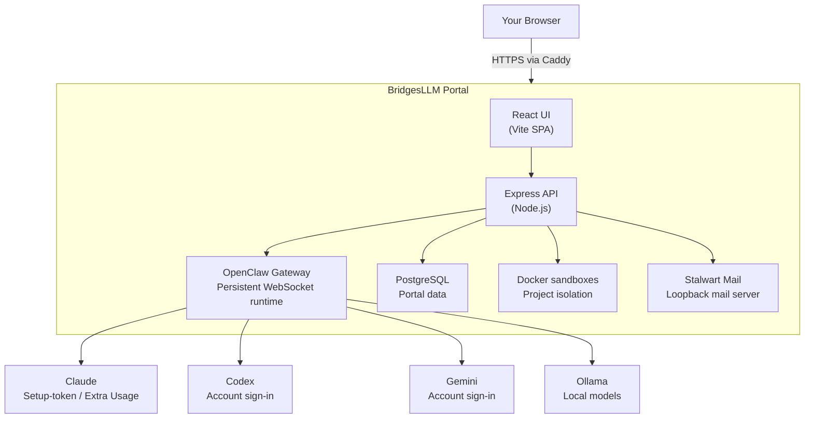

<p align="center">
  
</p>

<h1 align="center">BridgesLLM Portal</h1>

<p align="center">
  <strong>Your entire AI workflow in one self-hosted web UI. One command to install.</strong>
</p>

<p align="center">
  <a href="https://bridgesllm.ai"></a>
  <a href="https://github.com/BridgesLLM-ai/portal/releases"></a>
  <a href="https://github.com/BridgesLLM-ai/portal/blob/main/LICENSE"></a>
  <a href="https://github.com/BridgesLLM-ai/portal/stargazers"></a>
  <a href="https://x.com/BridgesLlm90984"></a>
</p>

---

BridgesLLM Portal runs on [OpenClaw](https://github.com/openclaw/openclaw) and turns a supported Ubuntu or Debian VPS into a complete browser-based AI workstation — multi-provider agent chat, sandboxed code execution, a shared browser your agent controls while you watch, remote desktop, project management, file manager, email, and more. If OpenClaw is already installed, the portal installer detects it and uses the existing installation.

**Stop bouncing between tools.** Chat with Claude, Codex, Gemini, or local models. Have your agent browse the web, write code, manage files, send email — all from one tab, on a server you own.

**One command. Five minutes.**

```bash
curl -fsSL https://bridgesllm.ai/install.sh | sudo bash
```

### Requirements

- Ubuntu 22.04+ or Debian 12+
- 3.5 GB RAM minimum (4 GB+ recommended)
- 35 GB free disk space
- Root or sudo access

## 📺 See It in Action

Visit [bridgesllm.ai](https://bridgesllm.ai) for live video demos of every feature.

## 🎯 What You Get

### Agent Chat
Talk to Claude, Codex, Gemini, or Ollama through the provider path that fits each one — account sign-in where supported, Claude setup-token flow, API keys, or local models. Switch models mid-conversation. Powered by [OpenClaw](https://github.com/openclaw/openclaw).

### Shared Browser
Your agent controls a real Chrome browser via CDP — navigating, clicking, filling forms, extracting data — while you watch live on the remote desktop. Ask it to research something, check a page for bugs, or automate a web workflow.

### Projects & Code Sandbox
Create projects, edit code in-browser with Monaco Editor, and assign AI agents to tasks. Each project runs in an isolated Docker container. Git integration, live preview, autonomous background agents.

### Remote Desktop
Full graphical desktop via NoVNC — accessible from any device. Run GUI apps, browser automation, or visual workflows without SSH.

### Terminal
Full xterm.js terminal in the browser. Run commands, manage packages, monitor your server — no SSH client needed.

### File Manager
Browse, upload, edit, and manage server files. Drag-and-drop, in-browser editing, archive extraction.

### Email
Built-in Stalwart mail server. Read, compose, and send email with rich HTML rendering and attachments — from your own domain.

### Automations
Schedule recurring AI tasks with cron from the browser. Monitoring, reports, maintenance — runs while you sleep.

### Skills Marketplace
Browse and install agent skills from [ClawHub](https://clawhub.ai) with one click. Configure MCP tools and extend your agent's capabilities.

### Setup Wizard
Everything configured in-browser. Domain, SSL, providers, users — no CLI expertise needed. Codex and Gemini support account sign-in, Claude uses the guided setup-token flow, and key-based providers use API keys.

### Self-Updating Dashboard
One-click updates from the browser. Admin dashboard with user management, storage monitoring, and session controls.

## 🆕 Recent Changes

### v3.23.9 (April 9, 2026)
- **OpenClaw compatibility hotfix is explicit now** — admins can inspect and apply the older long-run relay patch directly from Settings or Agent Chat instead of doing hidden server-side edits.
- **The hotfix helper is actually bundled** — fresh installs now include the patch script the admin action depends on.
- **Gateway reloads fall back cleanly** — if `openclaw gateway restart` only reports a disabled service, the portal now signals the live gateway process so the hotfix still takes effect.

### v3.23.8 (April 7, 2026)
- **Project chat survives renames** — per-project assistant and session identity is now stable, so renaming a project no longer strands its AI chat state.
- **Large files degrade gracefully** — text files over 10MB now open in read-only preview mode instead of failing outright.
- **Project chat got session controls** — slash-command autocomplete and session controls are now available directly from the project chat UI.
- **Tasks tab is stabilized** — the Agent Tools Tasks view now uses a single cached gateway fetch instead of hammering the gateway with per-task history lookups.
- **Project ZIP exports are cleaner** — internal agent-state files are stripped from clean and stripped downloads.

### v3.23.7 (April 7, 2026)
- **Project AI chat is far more dependable** — first-open model selection, per-project session routing, history recovery, and rapid project switching all got a real stability pass.
- **Agent chats recover better** — reloads, reconnects, attachment handoff, active stream recovery, and fallback abort behavior are all more reliable.
- **Files and links behave better** — attachment access across refreshes and split-host setups is fixed, and chat file links resolve more cleanly.
- **Tasks feel cleaner** — long-running work, summaries, and related session controls load with less friction.
- **Security got tighter** — AI file helpers, share-link mutations, signed tool URLs, and browser direct-gateway exposure were all hardened in this pass.

### v3.23.6 (April 5, 2026)
- **Mobile Safari / 2FA login is hardened** — when login enters the 2FA step, the portal now explicitly clears stale auth cookies so an old session cannot immediately trigger a bogus refresh failure.
- **Broken refresh tokens now clean up after themselves** — invalid or expired refresh/logout paths actively expire the browser auth cookies instead of leaving a poisoned session behind.
- **Unauthenticated restore races are blocked** — the frontend only attempts cookie-based session recovery during explicit restore-session probes and never while 2FA is pending, so the generic `login failed` collapse stops happening on mobile.

### v3.23.5 (April 5, 2026)
- **Claude (OpenClaw) setup is back on the sane path** — the failed Claude CLI bridge detour is gone, so Anthropic/OpenClaw setup is once again the normal setup-token flow.
- **Anthropic billing is now explicit in the UI** — Claude setup surfaces now show a hard Extra Usage warning, explain that a bundle may be required, and link straight to Claude usage settings.
- **Project chat no longer gets stuck after a missing final completion event** — `stream_ended` is now treated as terminal so hanging spinners clear properly.

### v3.23.4 (April 5, 2026)
- **Claude subscription setup actually works from the portal now** — the server Claude Code login is imported into OpenClaw as Anthropic OAuth, the default stays on canonical `anthropic/...` model IDs, and the bad `claude-cli/...` runtime mismatch is no longer surfaced to users.
- **Model picker labels are finally unambiguous** — OpenClaw chat selectors now show clearer provider/runtime badges and canonical model IDs, so duplicate-looking Sonnet/Opus entries stop being a guessing game.
- **Session/model switching and stuck-wait states are hardened** — project chat now repatches stale sessions onto the intended model, and both main/project chat stop spinning forever when the stream ends without a final `done` event.

### v3.23.3 (April 4, 2026)
- **Claude subscription setup now prefers server Claude CLI** — admins are guided to log into Claude Code on the server first, then connect OpenClaw to the local `claude-cli/...` runtime instead of defaulting people toward API-key billing.
- **OpenClaw Anthropic bridge added** — the portal can now switch OpenClaw over to Claude CLI-backed Anthropic auth from the UI and keep the chosen Claude model aligned.
- **Claude provider status is more honest** — the AI Providers page now recognizes Claude CLI-backed Anthropic setups, labels them correctly, and cleans them up properly if removed.

### v3.23.2 (April 4, 2026)
- **Claude Code OAuth fix** — Agent Chat now strips conflicting inherited Anthropic API keys when Claude Code is already logged in on the server, fixing the bogus `Invalid API key · Fix external API key` failure after successful OAuth setup.
- **Native provider session hardening** — switching from OpenClaw into Claude/Codex/Gemini no longer reuses foreign session IDs, so native provider history loads and first messages start cleanly instead of failing against stale `main`, `new-*`, or `agent:*` session keys.

### v3.23.1 (April 2, 2026)
- **Agent Chat crash hotfix** — fixes `model.split is not a function` crashes caused by structured OpenClaw model configs leaking into the portal UI.
- **Backend model normalization** — portal gateway responses now normalize structured model objects into stable string IDs before returning them to the frontend.
- **UI hardening** — Agent Chat, Agent Tools, Usage, and Terminal status views now safely render model labels even when upstream model data is not a plain string.

### v3.23.0 (April 2, 2026)
- **Background Tasks page + Agent Tools tab** — view running and recent subagents/cron jobs with status, duration, summaries, and failures.
- **Project chat reconnect hardening** — fixes stale assistant text and phantom partial bubbles after reconnects, tab sleep, and tool/thinking transitions.
- Fix Tasks API path regression (`/api/api/gateway/tasks` → `/api/gateway/tasks`).


### v3.22.0 (April 1, 2026)
- **OpenClaw gateway compatibility update** (2026.3.31) — improved exec approvals, provider error recovery, background task flows
- Remove unused analytics/installer subdomain routes (dead config causing TLS cert errors)
- Close public analytics dashboard exposure — now portal-auth only

### v3.21.0 (March 31, 2026)
- **Remote Desktop clipboard & mobile keyboard** — floating toolbar with clipboard paste (Read/Paste/Type modes) and mobile soft keyboard support. Copy-paste and type into your VNC session from any device.

### v3.20.1 (March 29, 2026)
- Fix Claude Code native login on headless servers (direct PKCE OAuth flow)
- Fix Codex read-only sessions — now launches with full `workspace-write` sandbox
- Fix Gemini native auth detection
- Project chat inherits gateway default model correctly

### v3.20.0 (March 29, 2026)
- **Security:** Remove XSS vector from markdown renderer (rehype-raw)
- **Critical:** Fix installer destroying portal on update when using non-default database config
- Fix Anthropic API key persistence, stale "Agent is thinking" indicator, missed messages after phone lock
- Fix code preview dark mode, auto-detect bare HTML responses

See the full [CHANGELOG](CHANGELOG.md) for all releases.

## 🏗️ Architecture



- **Caddy** terminates HTTPS (automatic Let's Encrypt) and reverse-proxies to the backend.
- **OpenClaw Gateway** manages agent sessions, tool approvals, and provider communication over persistent WebSocket.
- **Docker sandboxes** isolate each project's code execution from the host.
- **Stalwart** provides email on the loopback interface — not exposed as an open relay.

## 💰 Cost Model

BridgesLLM Portal itself is **free**. Your cost is the combination of:

- your VPS
- the provider path you choose
- your usage pattern

Typical cost components:

| Component | Typical cost model |
|-----------|--------------------|
| VPS | Usually ~$20–40/mo for a comfortably sized box |
| Codex / Gemini | Account or subscription-style sign-in paths are available |
| Claude | Claude plan **plus Anthropic Extra Usage** for OpenClaw-driven traffic |
| API-key providers | Usage-based billing |
| Ollama | Local compute on your own server |

There is no single universal monthly total because provider billing differs by path.

## 🔧 Tech Stack

| Layer | Technology |
|-------|-----------|
| Frontend | React 19, Vite, Tailwind CSS, Monaco Editor |
| Backend | Node.js, Express, Prisma, PostgreSQL |
| Agent Framework | [OpenClaw](https://github.com/openclaw/openclaw) (open-source) |
| AI Providers | Anthropic (Claude), OpenAI (Codex), Google (Gemini), Ollama (local) |
| Reverse Proxy | Caddy (automatic HTTPS) |
| Containers | Docker (per-project sandboxing) |
| Remote Desktop | NoVNC + Xfce4 |
| Email | Stalwart Mail Server |

## 🔄 Updating

Best path: click the **Update** button in the portal dashboard. Or from SSH:

```bash
curl -fsSL https://bridgesllm.ai/install.sh | sudo bash -s -- --update
```

The update flow updates the portal and checks installed dependencies, including OpenClaw, so you usually do **not** need to update OpenClaw separately first.

Updates preserve your data, projects, and configuration.

## ❓ Common Questions

### Can I install BridgesLLM Portal on a VPS that already has OpenClaw?
Yes. The installer detects an existing OpenClaw installation and uses it. If OpenClaw is not already present, the installer installs it for you.

### Do I need API keys for every provider?
No. Codex and Gemini support account sign-in flows. Claude uses the guided setup-token flow and currently requires Anthropic Extra Usage for OpenClaw-driven requests. Key-based providers still use API keys, and Ollama is local.

### Does my data stay on my VPS?
Yes. Your portal data, files, projects, and local services stay on your server. If you connect external AI providers, model requests still go to the provider you chose.

### What does the installer set up automatically?
The installer sets up the portal app, OpenClaw, PostgreSQL, Caddy, and the main system services. The browser setup flow then handles your admin account, provider connection, and domain/SSL steps.

## 🔒 Security

- **HTTPS everywhere** — automatic Let's Encrypt SSL with HSTS, CSP, and strict security headers
- **Sandboxed code execution** — each project runs in an isolated Docker container with filesystem restrictions
- **Path traversal protection** — dedicated middleware blocks directory escapes, symlink attacks, and system path access
- **Role-based access control** — Owner, Admin, User, and Viewer roles with account approval workflow
- **JWT authentication** — short-lived access tokens, no query-parameter auth
- **Firewall by default** — UFW configured during install; only SSH, HTTP, and HTTPS exposed
- **Malware scanning** — uploaded files scanned with ClamAV before storage
- **Mail server isolation** — Stalwart locked to loopback interface, not exposed as an open relay
- **Shell-escape enforcement** — all user-influenced parameters are properly escaped before reaching shell commands

For the full security policy, see [SECURITY.md](SECURITY.md).

## 📋 Roadmap

- [ ] **Chat reliability hardening** — survive hard refresh, tab close, and reconnect without losing streamed content or showing stale state
- [ ] **Clean chat output** — strip internal tool noise, approval artifacts, and system metadata from agent responses so conversations read like conversations
- [ ] **Full OpenClaw feature parity** — surface all OpenClaw capabilities (FYI mode, tool approval workflows, new agent features) as they ship upstream
- [ ] **Agent management UI** — create, edit, configure, and delete agents directly from the Agent Tools page
- [ ] **GitHub integration** — push/pull from the project panel
- [ ] **Team collaboration** — multi-user project sharing and permissions
- [ ] **Email polish** — forwarding rules, HTML signatures, folder management
- [ ] **Mobile-optimized UI** — responsive layouts for phone and tablet

## 🤝 Contributing

Contributions welcome! Please open an issue first to discuss significant changes.

1. Fork the repo
2. Create your feature branch (`git checkout -b feature/amazing-feature`)
3. Commit your changes (`git commit -m 'Add amazing feature'`)
4. Push to the branch (`git push origin feature/amazing-feature`)
5. Open a Pull Request

See [CONTRIBUTING.md](CONTRIBUTING.md) for full details.

## 📄 License

MIT License — see [LICENSE](LICENSE).

## 🙏 Acknowledgments

- [OpenClaw](https://github.com/openclaw/openclaw) — the agent framework powering intelligent features
- [Anthropic](https://anthropic.com), [OpenAI](https://openai.com), [Google](https://ai.google.dev) — AI providers
- [Caddy](https://caddyserver.com) — automatic HTTPS reverse proxy
- [Stalwart](https://stalw.art) — mail server
- [NoVNC](https://novnc.com) — browser-based VNC client

---

<p align="center">
  <strong>Built by <a href="https://github.com/Robertmonkey">Robert Bridges</a></strong>
  <br>
  <a href="https://bridgesllm.ai">Website</a> ·
  <a href="https://x.com/BridgesLlm90984">X (Twitter)</a> ·
  <a href="https://github.com/BridgesLLM-ai/portal/issues">Issues</a> ·
  <a href="https://github.com/BridgesLLM-ai/portal/releases">Releases</a>
</p>
