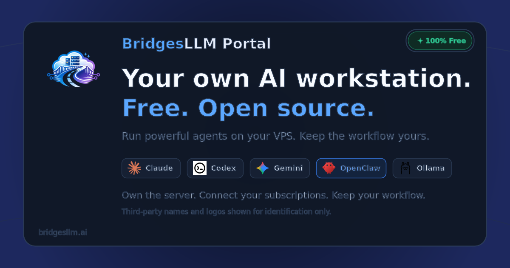
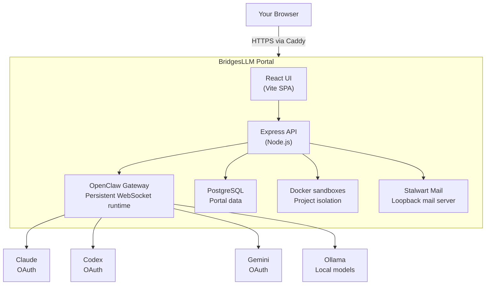

<p align="center">
  
</p>

<h1 align="center">BridgesLLM Portal</h1>

<p align="center">
  <strong>Your entire AI workflow in one self-hosted web UI. One command to install.</strong>
</p>

<p align="center">
  <a href="https://bridgesllm.ai"></a>
  <a href="https://github.com/BridgesLLM-ai/portal/releases"></a>
  <a href="https://github.com/BridgesLLM-ai/portal/blob/main/LICENSE"></a>
  <a href="https://github.com/BridgesLLM-ai/portal/stargazers"></a>
  <a href="https://x.com/BridgesLlm90984"></a>
</p>

---

BridgesLLM Portal installs [OpenClaw](https://github.com/openclaw/openclaw) on any VPS and wraps it in a complete browser-based AI workstation — multi-provider agent chat, sandboxed code execution, a shared browser your agent controls while you watch, remote desktop, project management, file manager, email, and more.

**Stop bouncing between tools.** Chat with Claude, Codex, or Gemini. Have your agent browse the web, write code, manage files, send email — all from one tab, on a server you own.

**One command. Five minutes.**

```bash
curl -fsSL https://bridgesllm.ai/install.sh | sudo bash
```

### Requirements

- Ubuntu 22.04+ or Debian 12+
- 3.5 GB RAM minimum (4 GB+ recommended)
- 35 GB free disk space
- Root or sudo access

## 📺 See It in Action

Visit [bridgesllm.ai](https://bridgesllm.ai) for live video demos of every feature.

## 🎯 What You Get

### Agent Chat
Talk to Claude, Codex, Gemini, or Ollama — all via flat-rate OAuth subscriptions, not per-token billing. Switch models mid-conversation. Powered by [OpenClaw](https://github.com/openclaw/openclaw).

### Shared Browser
Your agent controls a real Chrome browser via CDP — navigating, clicking, filling forms, extracting data — while you watch live on the remote desktop. Ask it to research something, check a page for bugs, or automate a web workflow.

### Projects & Code Sandbox
Create projects, edit code in-browser with Monaco Editor, and assign AI agents to tasks. Each project runs in an isolated Docker container. Git integration, live preview, autonomous background agents.

### Remote Desktop
Full graphical desktop via NoVNC — accessible from any device. Run GUI apps, browser automation, or visual workflows without SSH.

### Terminal
Full xterm.js terminal in the browser. Run commands, manage packages, monitor your server — no SSH client needed.

### File Manager
Browse, upload, edit, and manage server files. Drag-and-drop, in-browser editing, archive extraction.

### Email
Built-in Stalwart mail server. Read, compose, and send email with rich HTML rendering and attachments — from your own domain.

### Automations
Schedule recurring AI tasks with cron from the browser. Monitoring, reports, maintenance — runs while you sleep.

### Skills Marketplace
Browse and install agent skills from [ClawHub](https://clawhub.ai) with one click. Configure MCP tools and extend your agent's capabilities.

### Setup Wizard
Everything configured in-browser. Domain, SSL, OAuth providers, users — no CLI expertise needed. One-click OAuth sign-in for Claude, Codex, and Gemini.

### Self-Updating Dashboard
One-click updates from the browser. Admin dashboard with user management, storage monitoring, and session controls.

## 🆕 Recent Changes

### v3.24.0 (April 4, 2026)
- **Tasks tab overhaul** — Expandable card layout with status colors, duration tracking, and native OpenClaw task registry integration
- **Native CLI provider panel** — Agent Tools page shows Claude Code, Codex, and Gemini status with auth state and model catalogs
- **Security hardening** — enabledProviders enforcement on HTTP and WebSocket, tiered native CLI permissions, .env file lockdown
- **Chat system fixes** — Steering message rendering, NO_REPLY suppression, inactivity-based turn timeout (600s), control character sanitization, internal context leak prevention
- **Performance** — Async CLI commands, non-blocking provider cache with TTL, lazy-loaded routes, turn-level cost display
- **Settings cleanup** — Removed dead panels, wired up enabled providers and default provider selection
- Remove unused analytics/installer subdomain routes (dead config causing TLS cert errors)
- Close public analytics dashboard exposure — now portal-auth only

### v3.21.0 (March 31, 2026)
- **Remote Desktop clipboard & mobile keyboard** — floating toolbar with clipboard paste (Read/Paste/Type modes) and mobile soft keyboard support. Copy-paste and type into your VNC session from any device.

### v3.20.1 (March 29, 2026)
- Fix Claude Code native login on headless servers (direct PKCE OAuth flow)
- Fix Codex read-only sessions — now launches with full `workspace-write` sandbox
- Fix Gemini native auth detection
- Project chat inherits gateway default model correctly

### v3.20.0 (March 29, 2026)
- **Security:** Remove XSS vector from markdown renderer (rehype-raw)
- **Critical:** Fix installer destroying portal on update when using non-default database config
- Fix Anthropic API key persistence, stale "Agent is thinking" indicator, missed messages after phone lock
- Fix code preview dark mode, auto-detect bare HTML responses

See the full [CHANGELOG](CHANGELOG.md) for all releases.

## 🏗️ Architecture



- **Caddy** terminates HTTPS (automatic Let's Encrypt) and reverse-proxies to the backend.
- **OpenClaw Gateway** manages agent sessions, tool approvals, and provider communication over persistent WebSocket.
- **Docker sandboxes** isolate each project's code execution from the host.
- **Stalwart** provides email on the loopback interface — not exposed as an open relay.

## 💰 Cost Comparison

| Setup | Monthly Cost | Hardware Upfront |
|-------|-------------|-----------------|
| **VPS + BridgesLLM Portal** | **$80–140/mo** | **$0** |
| Mac Mini M4 + API keys | $217–517/mo | $800 |
| Gaming PC + API keys | $285–635/mo | $1,200 |
| Cloud IDEs (Codespaces) | $58+/mo | $0 (limited AI) |

*Portal is free. VPS is $5–20/mo. AI subscriptions (Claude, Codex, Gemini) are ~$20/mo each — flat-rate, not per-token.*

## 🔧 Tech Stack

| Layer | Technology |
|-------|-----------|
| Frontend | React 19, Vite, Tailwind CSS, Monaco Editor |
| Backend | Node.js, Express, Prisma, PostgreSQL |
| Agent Framework | [OpenClaw](https://github.com/openclaw/openclaw) (open-source) |
| AI Providers | Anthropic (Claude), OpenAI (Codex), Google (Gemini), Ollama (local) |
| Reverse Proxy | Caddy (automatic HTTPS) |
| Containers | Docker (per-project sandboxing) |
| Remote Desktop | NoVNC + Xfce4 |
| Email | Stalwart Mail Server |

## 🔄 Updating

From your portal dashboard, click the **Update** button. Or from SSH:

```bash
curl -fsSL https://bridgesllm.ai/install.sh | sudo bash -s -- --update
```

Updates preserve all your data, projects, and configuration.

## 🔒 Security

- **HTTPS everywhere** — automatic Let's Encrypt SSL with HSTS, CSP, and strict security headers
- **Sandboxed code execution** — each project runs in an isolated Docker container with filesystem restrictions
- **Path traversal protection** — dedicated middleware blocks directory escapes, symlink attacks, and system path access
- **Role-based access control** — Owner, Admin, User, and Viewer roles with account approval workflow
- **JWT authentication** — short-lived access tokens, no query-parameter auth
- **Firewall by default** — UFW configured during install; only SSH, HTTP, and HTTPS exposed
- **Malware scanning** — uploaded files scanned with ClamAV before storage
- **Mail server isolation** — Stalwart locked to loopback interface, not exposed as an open relay
- **Shell-escape enforcement** — all user-influenced parameters are properly escaped before reaching shell commands

For the full security policy, see [SECURITY.md](SECURITY.md).

## 📋 Roadmap

- [ ] **Chat reliability hardening** — survive hard refresh, tab close, and reconnect without losing streamed content or showing stale state
- [ ] **Clean chat output** — strip internal tool noise, approval artifacts, and system metadata from agent responses so conversations read like conversations
- [ ] **Full OpenClaw feature parity** — surface all OpenClaw capabilities (FYI mode, tool approval workflows, new agent features) as they ship upstream
- [ ] **Agent management UI** — create, edit, configure, and delete agents directly from the Agent Tools page
- [ ] **GitHub integration** — push/pull from the project panel
- [ ] **Team collaboration** — multi-user project sharing and permissions
- [ ] **Email polish** — forwarding rules, HTML signatures, folder management
- [ ] **Mobile-optimized UI** — responsive layouts for phone and tablet

## 🤝 Contributing

Contributions welcome! Please open an issue first to discuss significant changes.

1. Fork the repo
2. Create your feature branch (`git checkout -b feature/amazing-feature`)
3. Commit your changes (`git commit -m 'Add amazing feature'`)
4. Push to the branch (`git push origin feature/amazing-feature`)
5. Open a Pull Request

See [CONTRIBUTING.md](CONTRIBUTING.md) for full details.

## 📄 License

MIT License — see [LICENSE](LICENSE).

## 🙏 Acknowledgments

- [OpenClaw](https://github.com/openclaw/openclaw) — the agent framework powering intelligent features
- [Anthropic](https://anthropic.com), [OpenAI](https://openai.com), [Google](https://ai.google.dev) — AI providers
- [Caddy](https://caddyserver.com) — automatic HTTPS reverse proxy
- [Stalwart](https://stalw.art) — mail server
- [NoVNC](https://novnc.com) — browser-based VNC client

---

<p align="center">
  <strong>Built by <a href="https://github.com/Robertmonkey">Robert Bridges</a></strong>
  <br>
  <a href="https://bridgesllm.ai">Website</a> ·
  <a href="https://x.com/BridgesLlm90984">X (Twitter)</a> ·
  <a href="https://github.com/BridgesLLM-ai/portal/issues">Issues</a> ·
  <a href="https://github.com/BridgesLLM-ai/portal/releases">Releases</a>
</p>
