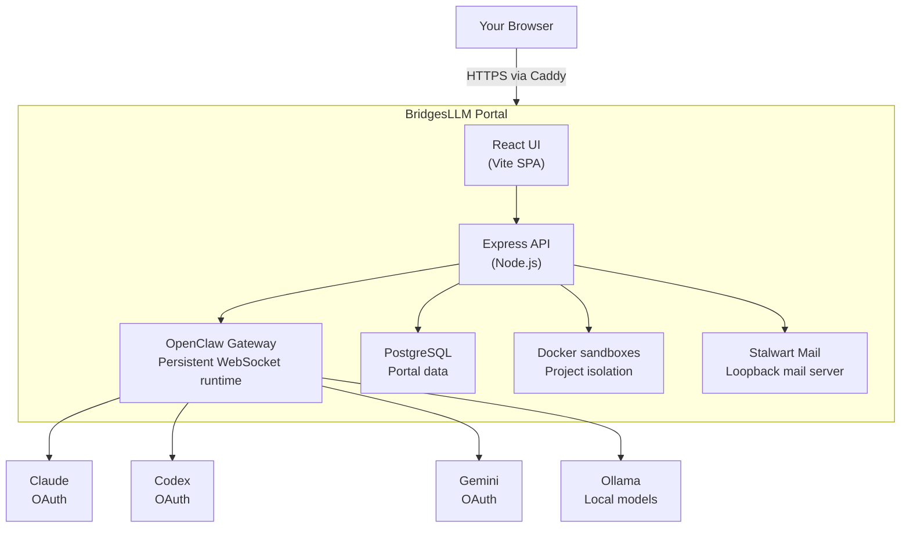

<p align="center">
  
</p>

<h1 align="center">BridgesLLM Portal</h1>

<p align="center">
  <strong>The easiest way to run OpenClaw on a VPS. Full web UI. One command.</strong>
</p>

<p align="center">
  <a href="https://bridgesllm.ai"></a>
  <a href="https://github.com/BridgesLLM-ai/portal/releases"></a>
  <a href="https://github.com/BridgesLLM-ai/portal/blob/main/LICENSE"></a>
  <a href="https://github.com/BridgesLLM-ai/portal/stargazers"></a>
  <a href="https://github.com/BridgesLLM-ai/portal/actions/workflows/ci.yml"></a>
</p>

---

BridgesLLM Portal installs [OpenClaw](https://github.com/openclaw/openclaw) on any VPS and wraps it in a complete browser-based AI workstation — multi-provider agent chat, sandboxed code execution, remote desktop, project management, file manager, email server, and more.

**Lower the friction.** One curl command replaces hours of manual setup. No CLI expertise needed.
**Lower the cost.** Flat-rate OAuth subscriptions (~$20/mo each) instead of unpredictable per-token API bills. A $5-20/mo VPS instead of $800+ hardware.

## ⚡ Quick Install

```bash
curl -fsSL https://bridgesllm.ai/install.sh | sudo bash
```

That's it. Takes about 5 minutes on a warmed-up VPS. On a brand-new server, package-manager initialization can add extra time — the installer now tells you exactly what it's waiting on instead of looking frozen.

### Requirements

- Ubuntu 22.04+ or Debian 12+
- 3.5GB RAM minimum (4GB+ recommended)
- 35GB free disk space
- Root or sudo access

## 🆕 What's New in 3.19.0

- **AI-controlled shared browser** — your agent controls a real Chrome browser via CDP while you watch live on the remote desktop. Navigate, click, fill forms, extract data — in real-time.
- **Browser-based terminal** — full xterm.js terminal in the portal. Run commands, manage packages, monitor your server — no SSH client needed.
- **Skills marketplace** — browse and install agent skills from ClawHub with one click. Configure MCP tools from the browser.
- **Automations** — schedule recurring AI tasks with cron from the Agent Tools page. Runs while you sleep.
- **Enhanced security** — path traversal middleware, role-based access control, ClamAV malware scanning, JWT hardening, and comprehensive [security documentation](SECURITY.md).
- **Refreshed marketing site** — new feature videos, FAQ structured data, and updated positioning at [bridgesllm.ai](https://bridgesllm.ai).

## 🎯 What You Get

| Feature | Description |
|---------|-------------|
| **Multi-Provider Agent Chat** | Claude, Codex, Gemini, Ollama — all via flat-rate OAuth subscriptions, not per-token billing. Switch models mid-conversation. Powered by [OpenClaw](https://github.com/openclaw/openclaw). |
| **AI-Controlled Shared Browser** | Your agent controls a real Chrome browser via CDP — navigating, clicking, extracting data — while you watch live on the remote desktop. |
| **AI-Powered Projects** | Create projects, edit code in-browser, assign AI agents to tasks. Git integration, live preview, and autonomous background agents. |
| **Sandboxed Code Execution** | Run AI-generated code in isolated Docker containers per project. Nothing breaks your server. |
| **Browser-Based Remote Desktop** | Full graphical desktop via NoVNC. Run GUI apps, browser automation, or visual workflows from any device. |
| **Browser-Based Terminal** | Full xterm.js terminal in your browser. Run commands, manage packages, monitor your server — no SSH client needed. |
| **File Manager** | Browse, upload, edit, and manage server files. Drag-and-drop, in-browser editing, archive extraction. |
| **Built-In Email Server** | Stalwart mail server included. Read, compose, and send email with rich HTML rendering and attachments — from your own domain. |
| **Skills Marketplace** | Browse and install agent skills from ClawHub with one click. Configure MCP tools and extend your agent's capabilities from the browser. |
| **Automations** | Schedule recurring AI tasks with cron from the browser. Monitoring, reports, maintenance — runs while you sleep. |
| **Self-Updating Dashboard** | One-click updates from the browser. Admin dashboard with user management, storage, and session monitoring. |
| **Setup Wizard** | Everything configured in-browser. Domain, SSL, OAuth, users — no CLI expertise needed. |

## 🏗️ Architecture



### Notes

- **Caddy** terminates HTTPS and forwards the portal to the local backend.
- **OpenClaw Gateway** handles agent sessions, approvals, tool calls, and provider communication.
- **Docker sandboxes** isolate project execution from the host.
- **Stalwart** provides built-in email so the portal can own outbound and user mailbox flows.

## 💰 Cost Comparison

| Setup | Monthly Cost | Hardware Upfront |
|-------|-------------|-----------------|
| **VPS + BridgesLLM Portal** | **$80–140/mo** | **$0** |
| Mac Mini M4 + API keys | $217–517/mo | $800 |
| Gaming PC + API keys | $285–635/mo | $1,200 |
| Cloud IDEs (Codespaces) | $58+/mo | $0 (limited AI) |

*Portal is free. VPS is $20–40/mo. AI subscriptions (Claude, Codex, Gemini) are ~$20/mo each — flat-rate, not per-token.*

## 🔧 Tech Stack

- **Frontend:** React 19 + Vite + Tailwind CSS + Monaco Editor
- **Backend:** Node.js + Express + Prisma + PostgreSQL
- **Agent Framework:** [OpenClaw](https://github.com/openclaw/openclaw) (open-source)
- **AI Providers:** Anthropic (Claude), OpenAI (Codex), Google (Gemini), Ollama (local)
- **Reverse Proxy:** Caddy (automatic HTTPS)
- **Containers:** Docker (per-project sandboxing)
- **Remote Desktop:** NoVNC + Xfce4
- **Email:** Stalwart Mail Server

## 📸 Screenshots

Visit [bridgesllm.ai](https://bridgesllm.ai) to see live video demos of every feature.

## 🔄 Updating

From your portal dashboard, click the **Update** button. Or from SSH:

```bash
curl -fsSL https://bridgesllm.ai/install.sh | sudo bash -s -- --update
```

Updates preserve all your data, projects, and configuration.

## 🔒 Security

- **HTTPS everywhere** — automatic Let's Encrypt SSL with HSTS, CSP, and strict security headers
- **Sandboxed code execution** — each project runs in an isolated Docker container with filesystem restrictions
- **Path traversal protection** — dedicated middleware blocks directory escapes, symlink attacks, and access to system paths
- **Role-based access control** — Owner, Admin, User, and Viewer roles with account approval workflow
- **JWT authentication** — short-lived access tokens, no query-parameter auth (prevents token leakage in logs)
- **Firewall by default** — UFW configured during install; only SSH, HTTP, and HTTPS exposed externally
- **Malware scanning** — uploaded files scanned with ClamAV before storage
- **Mail server isolation** — Stalwart locked to loopback interface, not exposed as an open relay
- **Gateway auth** — token-based WebSocket protocol for OpenClaw communication

For the full security policy, including known limitations and hardening recommendations, see [SECURITY.md](SECURITY.md).

## 📋 Roadmap

- [ ] **Full OpenClaw feature parity** — FYI mode, tool approval workflows, and new agent capabilities as OpenClaw ships them
- [ ] **Agent Zero integration** — add full provider support for Agent Zero alongside Claude, Codex, Gemini, and Ollama
- [ ] **Email polish** — automated forwarding rules, HTML signatures with images, folder management
- [ ] **Upstream tracking** — keep pace with daily updates to OpenClaw, Ollama, Caddy, and coding CLIs
- [ ] **GitHub integration** — push/pull from the project panel
- [ ] **Team collaboration** — multi-user project sharing and permissions
- [ ] **Template marketplace** — starter projects and boilerplate generators

## 🤝 Contributing

Contributions are welcome. Please open an issue first to discuss significant changes.

1. Fork the repo
2. Create your feature branch (`git checkout -b feature/amazing-feature`)
3. Commit your changes (`git commit -m 'Add amazing feature'`)
4. Push to the branch (`git push origin feature/amazing-feature`)
5. Open a Pull Request

## 📄 License

This project is licensed under the MIT License — see the [LICENSE](LICENSE) file for details.

## 🙏 Acknowledgments

- [OpenClaw](https://github.com/openclaw/openclaw) — the agent framework that powers intelligent features
- [Anthropic](https://anthropic.com), [OpenAI](https://openai.com), [Google](https://ai.google.dev) — AI providers
- [Caddy](https://caddyserver.com) — automatic HTTPS reverse proxy
- [Stalwart](https://stalw.art) — mail server
- [NoVNC](https://novnc.com) — browser-based VNC client

---

<p align="center">
  <strong>Built by <a href="https://github.com/Robertmonkey">Robert Bridges</a></strong>
  <br>
  <a href="https://bridgesllm.ai">Website</a> · <a href="https://github.com/BridgesLLM-ai/portal/issues">Issues</a> · <a href="https://github.com/BridgesLLM-ai/portal/releases">Releases</a>
</p>
