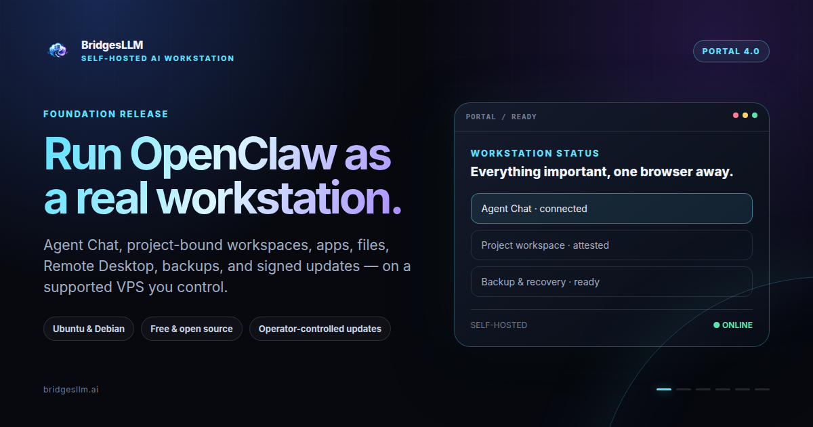
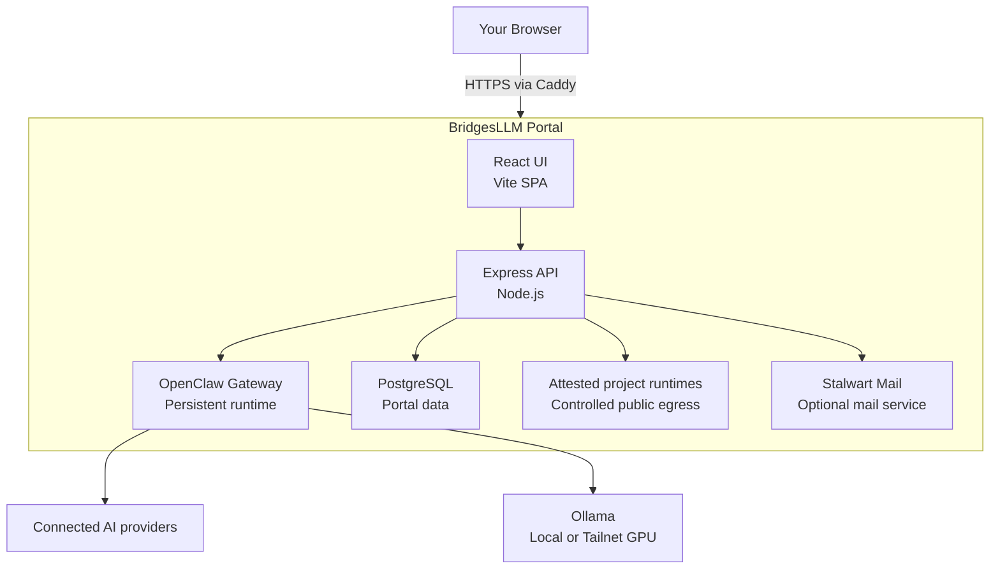

<p align="center">
  
</p>

<h1 align="center">BridgesLLM Portal</h1>

<p align="center">
  <strong>A self-hosted OpenClaw workstation for a VPS you control.</strong>
</p>

<p align="center">
  <a href="https://bridgesllm.ai"></a>
  <a href="https://github.com/BridgesLLM-ai/portal/releases"></a>
  <a href="https://github.com/BridgesLLM-ai/portal/blob/main/LICENSE"></a>
  <a href="https://github.com/BridgesLLM-ai/portal/stargazers"></a>
  <a href="https://x.com/BridgesLlm90984"></a>
</p>

---

BridgesLLM Portal runs on [OpenClaw](https://github.com/openclaw/openclaw) and turns a supported Ubuntu or Debian VPS into a browser-based AI workstation: agent chat, project-bound workspaces, hosted apps, files, a shared browser, Remote Desktop, mail, and operator tools. If OpenClaw is already installed, the Portal installer detects and validates the existing installation instead of creating a second one.

Connect the provider paths available to your accounts and host, including Claude, Codex, Gemini, API-key providers, and local or Tailnet-connected Ollama models. Availability still depends on provider credentials, entitlements, and the runtime qualification shown by the Portal.

```bash
curl -fsSL https://bridgesllm.ai/install.sh | sudo bash
```

## Requirements

- Ubuntu 22.04+ or Debian 12+
- 3.5 GB RAM minimum (4 GB+ recommended)
- 35 GB free disk space
- Root or sudo access
- A domain is recommended for the full HTTPS, mail, and public-sharing experience

## What changed in 4.0

Portal 4.0 is a foundation release: chat, projects, providers, updates, backups, and host-management paths now share stricter ownership and recovery contracts.

- **Answer an agent without changing pages.** Pending Agent Chat and Project Chat questions appear as persistent, expandable notifications. Reply in place or skip deliberately; a distinct sound can alert you after the browser has granted audio permission.
- **Long turns survive normal browser disruption.** Bounded durable history, reconnect replay, exact-run steering, cancellation, tool/thought rendering, and transcript windowing keep active work usable without unbounded browser growth.
- **Current Projects are isolated by default.** Project-bound runtimes created by 4.0, or admitted after safe reconciliation, use immutable user/project identity, one writable workspace, live attestation, and controlled public egress. Host, metadata, private-network, and sibling-project access fail closed.
- **Older Projects and Apps are preserved without inventing 4.0 authority.** An upgrade retains 3.x Project files, their exactly associated Apps, and App running/stopped intent. Startup enrolls each exact old Project root in the fail-closed legacy `NONE` state rather than calling it current. A Project with preserved 3.x OpenClaw lineage remains visible, but Project Chat and destructive Project-level operations stay unavailable until that lineage can be reconciled safely.
- **Provider setup tells the truth.** Backend-owned catalogs, exact model checks, runtime qualification, Agent Zero setup, current Claude/Codex/Google/xAI paths, and local or Tailnet Ollama management replace broad provider promises.
- **Updates are signed and transactional.** The Dashboard shows verified release details, requires backup preflight, serializes maintenance, applies database migrations, checks service/runtime health, and rolls back failed candidates.
- **The rest of the workstation caught up.** Setup, Files, Mail, Terminal, Remote Desktop, Apps, Tasks, Skills, Settings, Admin, light mode, accessibility, and bounded background operations all received reliability and clarity work.

Read the complete [4.0.0 changelog](CHANGELOG.md#400---2026-08-01) and [release history](https://github.com/BridgesLLM-ai/portal/releases).

## What you get

### Agent Chat

Use OpenClaw and supported native harnesses from one conversation surface. Switch among available providers and models, watch tool activity, approve guarded operations, steer a running turn, reconnect after a browser interruption, and answer agent questions from anywhere in the Portal.

### Projects and code sandbox

Create or import projects, edit code with Monaco, use Git, install dependencies, preview or deploy apps, and work with a project-bound agent. Project Chat is separate from host-operator Agent Chat: it gets one project workspace and controlled public egress while host, private-network, sibling-project, and credential access remain blocked. A provider stays unavailable in Projects until its adapter proves that boundary. Preserved 3.x Projects with unresolved OpenClaw lineage remain available as files and through exactly associated Apps, but are not admitted to Project Chat, rename, delete, or other destructive Project-level operations until safe reconciliation succeeds.

### Apps

Deploy static or full-stack project apps, manage their processes, and create password-, expiry-, or use-limited share links. Update and restore paths preserve standalone app sources and reconcile the apps that were running before maintenance.

### Shared browser and Remote Desktop

Use a real Chrome browser that an agent can control while you watch, or open the full Xfce desktop through noVNC. Remote Desktop includes audio, clipboard controls, resize recovery, keep-awake handling, and readiness checks. It remains an optional host capability and may require setup or repair from Settings.

### Files

Browse, search, upload, preview, edit, download, archive, and copy files into projects. Large uploads are resumable and bounded; path containment, active-content handling, and malware-scan failures are enforced server-side.

### Mail

Connect the bundled Stalwart mail service to use accounts, folders, search, attachments, signatures, and forwarding from the Portal. Mail is optional and needs a correctly configured domain, DNS, and public mail protocols.

### Terminal, tasks, automations, and skills

Operate the host from a browser terminal, schedule recurring agent work, inspect durable background jobs, and install reviewed skills from [ClawHub](https://clawhub.ai). Host-changing actions are role-gated, serialized where needed, and surfaced with explicit status instead of fire-and-forget responses.

### Setup and administration

Fresh setup creates a secure Owner first. Optional readiness cards then guide domain/TLS, mail, providers, local models, Remote Desktop, and other capabilities. Admin surfaces cover accounts, approvals, storage, alerts, backups, maintenance, update status, and scoped diagnostics.

## Architecture


```mermaid
flowchart TD
    Browser["Your Browser"] -->|HTTPS via Caddy| Portal

    subgraph Portal["BridgesLLM Portal"]
      UI["React UI\nVite SPA"]
      API["Express API\nNode.js"]
      UI --> API
      API --> Gateway["OpenClaw Gateway\nPersistent runtime"]
      API --> DB["PostgreSQL\nPortal data"]
      API --> Docker["Attested project runtimes\nControlled public egress"]
      API --> Mail["Stalwart Mail\nOptional mail service"]
    end

    Gateway --> Providers["Connected AI providers"]
    Gateway --> Ollama["Ollama\nLocal or Tailnet GPU"]
```

- **Caddy** terminates HTTPS and reverse-proxies to the loopback Portal backend.
- **OpenClaw Gateway** manages agent sessions, approvals, provider communication, and runtime events.
- **Project runtimes** are actor/project-bound, non-root, read-only except for one project mount, and synchronously attested before fresh or resumed turns.
- **Controlled egress** permits supported public web, Git, package, and asset traffic while blocking loopback, private, metadata, host, and lateral networks.
- **PostgreSQL and persistent data roots** hold Portal records, files, projects, app sources, and runtime state covered by the backup contract.

## Cost model

BridgesLLM Portal itself is free and open source. Operating cost depends on the VPS, optional services, provider path, and usage you choose. Subscription/account sign-in, usage-based API keys, and local compute have different limits and billing; the Portal does not turn them into one universal flat-rate plan.

## Updating

The recommended path is the Owner-only **Update** action in the Dashboard. From SSH:

```bash
curl -fsSL https://bridgesllm.ai/install.sh | sudo bash -s -- --update
```

The operator-triggered update flow verifies one signed Portal artifact, checks a fresh backup, preserves deploy lineage, applies migrations, validates the tested OpenClaw core/plugin pair, runs authenticated postflight checks, and rolls back if the candidate cannot become healthy. Unrelated CLI and host-tool upgrades stay in explicit maintenance paths instead of hiding inside every Portal update.

### Read before upgrading to 4.0

- Every user signs in again once after the 4.0 migration. Accounts and managed data are retained, subject to the legacy Project safety boundary below.
- Existing 3.x Project files, exactly associated Apps, and App running/stopped intent are retained. Startup records old Project roots as legacy `NONE`, not 4.0-current. Projects whose 3.x OpenClaw lineage is still preserved remain visible, while Project Chat and destructive Project-level operations stay unavailable until that lineage can be reconciled safely.
- Confined Project Chat runtimes require compatible kernel, Docker, and AppArmor support. Unsupported nested-container hosts can install with `--skip-project-runtimes`; Project Chat remains disabled there.
- A Complete wipe verifies recorded managed paths. It cannot find a copy moved elsewhere before uninstall, so review the host directly when it held sensitive data.
- Fresh 4.0 setup enables limited operational telemetry by default. The Owner can turn it off during setup or later in Settings, and existing telemetry choices are retained during update. The Portal reports shortly after startup and then about every 24 hours while it remains running. Turning it off stops that report only; Owner-Dashboard version lookups, manual refreshes, and limited installer lifecycle events remain separate.
- Windows/WSL remains an experimental local preview, not a supported production profile.

## Privacy and telemetry

Portal data, files, projects, credentials, and local services stay on the server you control. Requests sent to an external AI provider still leave the server under that provider's terms. Public shares and enabled mail protocols are also intentionally reachable outside the host.

Fresh 4.0 setup defaults limited operational telemetry to **on**, shows the choice before setup completes, and lets the Owner turn it off there or later in Settings. When enabled, the Portal sends a report shortly after startup and then about every 24 hours while it remains running. That report contains a random install ID, Portal and dependency versions, Portal user count, uptime, Node version, operating system, and architecture. It does not include messages, prompts, project files, credentials, usernames, or email addresses. Turning Portal telemetry off stops that operational report only. When an Owner opens Dashboard, the Portal separately checks the version endpoint for update availability; a manual refresh does the same. Those version lookups send no operational telemetry payload, although the endpoint receives normal request metadata. The installer independently reports install and update lifecycle milestones with the event type, Portal version, operating system name/version, and the random install ID. Normal download, package, provider, and other deliberately requested traffic also produces standard request metadata at the receiving service.

## Windows test drive (WSL 2 beta)

BridgesLLM Portal is VPS-first. Windows users can test it locally through WSL 2, but this path is experimental, currently untested in the field, and not a production deployment target.

Recommended Windows Terminal bootstrapper:

```powershell
irm https://raw.githubusercontent.com/BridgesLLM-ai/portal/main/installer/install-windows.ps1 | iex
```

If Ubuntu WSL is already ready:

```powershell
wsl -u root -- bash -lc "curl -fsSL https://bridgesllm.ai/install.sh | bash -s -- --local"
```

Then open `http://localhost:4001` in Windows. Public hosting, custom-domain HTTPS, and internet-facing share links remain VPS features. See [docs/WINDOWS_WSL_BETA.md](docs/WINDOWS_WSL_BETA.md) for caveats and setup details.

## Security

- **Secure bootstrap** — HTTPS or an explicit localhost tunnel, with single-use, expiring bootstrap credentials
- **Attested Project isolation** — immutable actor/project identity, exact runtime policy, one writable mount, and no host fallback
- **Controlled public egress** — supported public web/Git/package access without private, metadata, Docker, or host-network reachability
- **Path and content protection** — canonical containment, bounded archives/uploads, isolated active app content, and fail-closed malware-scan errors
- **Role-based access control** — Owner, root-equivalent Sub-Admin, User, and Viewer roles with account approval states
- **Signed rollback-safe updates** — manifest/content binding, runtime inventory, migrations, postflight, and deploy provenance
- **Least-exposed services** — internal APIs, database, browser control, Remote Desktop, and app backends stay loopback-only unless a documented public protocol requires exposure

Security boundaries depend on supported host capabilities and correct operator configuration. Review [SECURITY.md](SECURITY.md) for the security policy and reporting process.

## Roadmap

- [ ] 4.1: retire multi-user accounts only after their sessions, projects, files, apps, shares, and runtime state can be removed or reassigned transactionally
- [ ] 4.1: strengthen Complete wipe with positive residue proof beyond the recorded managed paths
- [ ] Add exact-conversation navigation and a durable notification history for pending agent questions
- [ ] Qualify more Project Chat providers against the same filesystem and public-egress escape matrix
- [ ] Mature the Windows/WSL preview into a supported local-install profile
- [ ] Expand reproducible browser, mobile, long-turn, and low-spec performance qualification

## Contributing

Contributions are welcome. Please open an issue before substantial changes so the design and security boundary can be discussed first.

1. Fork the repository.
2. Create a feature branch.
3. Make and test the change.
4. Push the branch to your fork.
5. Open a pull request.

See [CONTRIBUTING.md](CONTRIBUTING.md) for details.

## License

MIT License — see [LICENSE](LICENSE).

## Acknowledgments

- [OpenClaw](https://github.com/openclaw/openclaw) — agent framework
- [Anthropic](https://anthropic.com), [OpenAI](https://openai.com), and [Google](https://ai.google.dev) — AI providers
- [Caddy](https://caddyserver.com) — HTTPS reverse proxy
- [Stalwart](https://stalw.art) — mail server
- [NoVNC](https://novnc.com) — browser-based VNC client

---

<p align="center">
  <strong>Built by <a href="https://github.com/Robertmonkey">Robert Bridges</a></strong>
  <br>
  <a href="https://bridgesllm.ai">Website</a> ·
  <a href="https://x.com/BridgesLlm90984">X (Twitter)</a> ·
  <a href="https://github.com/BridgesLLM-ai/portal/issues">Issues</a> ·
  <a href="https://github.com/BridgesLLM-ai/portal/releases">Releases</a>
</p>
