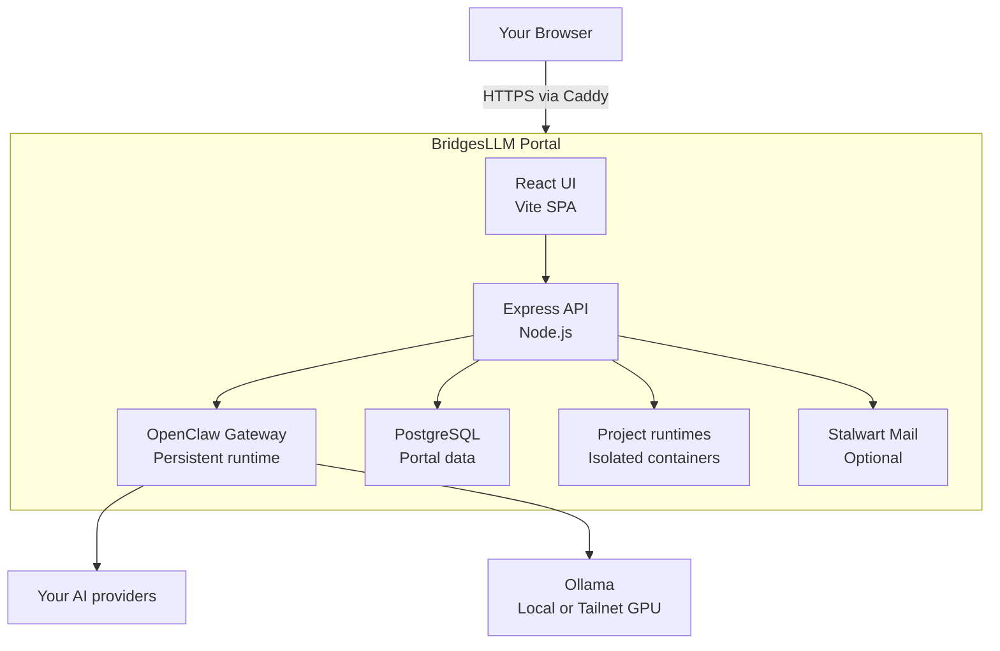

<p align="center">
  
</p>

<h1 align="center">BridgesLLM Portal</h1>

<p align="center">
  <strong>Your AI workstation, on a server you own.</strong>
</p>

<p align="center">
  <a href="https://bridgesllm.ai"></a>
  <a href="https://github.com/BridgesLLM-ai/portal/releases"></a>
  <a href="https://github.com/BridgesLLM-ai/portal/blob/main/LICENSE"></a>
  <a href="https://github.com/BridgesLLM-ai/portal/stargazers"></a>
  <a href="https://x.com/BridgesLlm90984"></a>
</p>

---

BridgesLLM Portal turns an Ubuntu or Debian VPS into an AI workstation you reach from any browser: agent chat, project workspaces, deployable apps, a file manager, a shared Chrome your agent drives while you watch, a full Linux desktop, mail, and a terminal. One login, one server, no tab sprawl.

Bring your own providers — Claude, Codex, Gemini, API keys, or Ollama running locally or on a GPU box across your Tailnet. The Portal is built on [OpenClaw](https://github.com/openclaw/openclaw), and if OpenClaw is already on the box, the installer adopts it rather than standing up a second copy.

```bash
curl -fsSL https://bridgesllm.ai/install.sh | sudo bash
```

Choose **Install** on a new server, or **Update / Repair** when Portal is already installed. Update and Repair preserve your data. Portal updates leave AI runtime versions unchanged, with a narrow question-plugin compatibility repair on supported OpenClaw 9.x installations; that repair may briefly reconnect the gateway. Nothing changes until you choose. For unattended installation, add `-s -- --install`; use `--repair` to reinstall Portal files without deleting data.

Ubuntu 22.04+ or Debian 12+ · 3.5 GB RAM (4 GB+ recommended) · 35 GB disk · root or sudo. A domain unlocks HTTPS, mail, and public share links.

## Current release: 5.0.9

Portal 5 brings a unified Project Work surface and broader native-harness support. The latest patch improves installer presentation and recovery, prevents hidden package prompts, and reduces unnecessary Chat work.

- **Chat history stays coherent.** Late message echoes do not add duplicate user messages; completed replies stay within their original turns. Tool calls gain their missing output without duplicate blocks, while intentionally repeated messages remain distinct.
- **Tasks are easier to follow.** Native progress cards show the current chat's plan, completion counts, and a scrollable panel that fits narrow screens. Unknown or stopped work is not presented as completed.
- **Project Work brings the workspace together.** Use project chat, files, history, preview, and Git in the project-scoped interface. Main Agent Chat remains a separate operator-level surface.
- **Maintenance is explicit.** Update Portal first, then review **Update Compatible AI Tools** for the release-qualified runtime set. Ordinary Portal updates do not upgrade the host interpreter or OpenClaw core. A supported 9.x question-plugin transition can briefly restart the gateway.
- **Backups have a clear scope.** Standard backups save Portal data and project files. Comprehensive adds available agent personality and Portal-native history as reference exports—not provider logins, runtime databases, mail, or a whole-server image.

Read the complete [5.0.9 changelog](CHANGELOG.md#509---2026-09-15), [update and compatibility guide](docs/UPDATING.md), and [documentation index](docs/README.md). Historical release notes describe their own versions, not the current installation contract.

## What you get

**Agent Chat** — One conversation surface for OpenClaw and native harnesses, with separate saved histories. Switch harnesses, use supported model controls, inspect tasks and tool calls, render Mermaid diagrams, steer or stop a turn, and return after a reload.

**Projects and code sandbox** — Create or import a project, edit in Monaco, run Git, install dependencies, preview or deploy, and hand the whole thing to an agent scoped to that one workspace.

**Apps** — Deploy static or full-stack apps out of a project, manage their processes, and hand out share links with a password, an expiry, or a use limit.

**Shared browser and Remote Desktop** — Watch an agent drive a real Chrome session, or take the full Xfce desktop through noVNC with audio, clipboard, and resize handling.

**Files** — Browse, search, upload, preview, edit, download, archive, and drop files straight into a project. Large uploads resume where they left off.

**Mail** — A bundled Stalwart mail server: accounts, folders, search, attachments, signatures, and forwarding on your own domain.

**Terminal, tasks, and skills** — A browser terminal on the host, scheduled recurring agent work, background jobs you can inspect, and skills from [ClawHub](https://clawhub.ai).

**Setup and admin** — Setup creates a secure Owner first, then walks optional domain/TLS, mail, providers, local models, and Remote Desktop. Admin covers accounts, storage, alerts, backups, maintenance, and updates. The [backup and recovery guide](docs/BACKUP_AND_RECOVERY.md) explains data-backup scope, verification, restore, and legacy archive compatibility.

## Architecture


```mermaid
flowchart TD
    Browser["Your Browser"] -->|HTTPS via Caddy| Portal

    subgraph Portal["BridgesLLM Portal"]
      UI["React UI\nVite SPA"]
      API["Express API\nNode.js"]
      UI --> API
      API --> Gateway["OpenClaw Gateway\nPersistent runtime"]
      API --> DB["PostgreSQL\nPortal data"]
      API --> Docker["Project runtimes\nIsolated containers"]
      API --> Mail["Stalwart Mail\nOptional"]
    end

    Gateway --> Providers["Your AI providers"]
    Gateway --> Ollama["Ollama\nLocal or Tailnet GPU"]
```

Caddy terminates HTTPS in front of a loopback-only backend. The OpenClaw gateway owns agent sessions, approvals, and provider traffic. Project runtimes are non-root containers with one writable mount and no route to the host, private networks, or each other. PostgreSQL and the persistent data roots hold everything the backup contract covers.

## What this doesn't do

Straight answers, in one place, rather than a disclaimer stapled to every paragraph:

- **The Portal is free. Running it isn't.** You pay for the VPS and for whatever provider you connect. Subscription sign-in, metered API keys, and local compute all bill differently, and the Portal doesn't paper over that with a flat rate.
- **Provider availability is yours, not ours.** Which models you can reach depends on your accounts and entitlements. The Portal reports what it can actually run.
- **Mail needs a real domain.** Correct DNS and public mail ports, or it stays off.
- **Project isolation needs a capable host.** Compatible kernel, Docker, and AppArmor. Nested-container hosts can install with `--skip-project-runtimes`, which leaves Project Chat disabled.
- **Windows/WSL is a preview.** Local test drive only — not a supported production profile. See [docs/WINDOWS_WSL_BETA.md](docs/WINDOWS_WSL_BETA.md).
- **Anything you send a provider leaves your server.** Under that provider's terms. Public shares and enabled mail ports are reachable from outside by design.
- **Fresh installs enable limited telemetry.** Install ID, versions, user count, uptime, Node/OS/arch — never prompts, files, credentials, or addresses. Turn it off during setup or in Settings. [Full detail below.](#privacy-and-telemetry)

## Updating

Use the Owner-only **Update** button in the Dashboard. From SSH:

```bash
curl -fsSL https://bridgesllm.ai/install.sh | sudo bash -s -- --update
```

Either path authenticates the signed release and exact installer, checks backup recoverability, stages the Portal while the current service remains online, proves a private candidate, and cuts over only after its runtime, schema, and readiness match the requested version. A failed Portal transaction rolls back its owned state.

Ordinary Portal updates preserve OpenClaw core, native CLI versions, provider credentials, and runtime data. **Exception:** on supported OpenClaw 9.1/9.2/9.3 installations, an obsolete question plugin is replaced with the compatible native plugin before Portal promotion. That bounded repair may briefly restart the gateway; it is not a core or provider upgrade. Already-compatible installations and the retained 2026.7.1 lane are unchanged by that repair.

The separate Owner-only **Update Compatible AI Tools** action installs the exact tools qualified for the Portal release. It does not follow upstream `latest`. The core bundle is transactional; subsequent optional-harness updates have separate checkpoints and are not one all-or-nothing transaction. Fresh installs provision the release-qualified tools on a supported host.

### Before updating

- **Back up and verify first.** Review the [backup scope and recovery guide](docs/BACKUP_AND_RECOVERY.md); use a VPS snapshot for whole-server recovery.
- **Portal first, compatible tools second.** Review [current pins, Node requirements, downtime, and recovery](docs/UPDATING.md). The Node version supported by Portal alone is not necessarily sufficient for the newer OpenClaw bundle.
- **Provider access remains account-dependent.** Installing a runtime does not sign in, grant model entitlement, or change your chosen default model.
- **Do not bypass interrupted-update records.** Resolve the reported condition; do not delete journals, fences, or provider authentication to make a retry pass.
- **Native DeepSeek remains unavailable.** DeepSeek API models through supported providers are a separate path from the disabled native harness.

## Privacy and telemetry

Your data, files, projects, credentials, and services stay on your server. Requests to an external AI provider leave it, under that provider's terms; public shares and enabled mail protocols are reachable from outside on purpose.

Fresh setup defaults limited operational telemetry to **on** and shows you the choice before setup finishes. When enabled, the Portal reports shortly after startup and roughly every 24 hours while running. That report carries a random install ID, Portal and dependency versions, user count, uptime, Node version, OS, and architecture. It carries no messages, prompts, project files, credentials, usernames, or email addresses. Turning it off stops that report. Separately, opening the Dashboard checks the version endpoint for updates, and a fresh installation sends start and completion events with the event type, version, OS, and install ID. Ordinary Portal updates do not send installer lifecycle events. Normal request metadata reaches the receiving service either way.

## Windows test drive (WSL 2 beta)

VPS-first, but you can kick the tires locally through WSL 2. Experimental, not field-tested, not production.

```powershell
irm https://raw.githubusercontent.com/BridgesLLM-ai/portal/main/installer/install-windows.ps1 | iex
```

If Ubuntu WSL is already set up:

```powershell
wsl -u root -- bash -lc "curl -fsSL https://bridgesllm.ai/install.sh | bash -s -- --local"
```

Then open `http://localhost:4001`. Public hosting, custom-domain HTTPS, and internet-facing share links stay VPS features. Caveats in [docs/WINDOWS_WSL_BETA.md](docs/WINDOWS_WSL_BETA.md).

## Security

- **Secure bootstrap** — HTTPS or an explicit localhost tunnel, with single-use expiring credentials
- **Project isolation** — immutable actor/project identity, one writable mount, no host fallback, verified before each turn
- **Scoped egress** — public web, Git, and package access; no private, metadata, Docker, or host-network reachability
- **Path and content protection** — canonical containment, size-limited archives and uploads, isolated active app content, malware-scan failures treated as failures
- **Role-based access** — Owner, Sub-Admin, User, and Viewer, with account approval states
- **Signed rollback-safe updates** — manifest and content binding, runtime inventory, migrations, postflight checks, deploy provenance
- **Least-exposed services** — internal APIs, the database, browser control, Remote Desktop, and app backends stay loopback-only unless a documented public protocol needs otherwise

These boundaries assume a supported host and correct operator configuration. Reporting process in [SECURITY.md](SECURITY.md).

## Roadmap

- [ ] Prove Complete wipe positively beyond the recorded managed paths before broadening its authority
- [ ] Deep-link agent questions to the exact conversation, plus a durable notification history
- [ ] Qualify more Project Chat providers against the same filesystem and egress escape matrix
- [ ] Add and qualify a native DeepSeek SDK harness, separate from DeepSeek API-model access
- [ ] Grow the Windows/WSL preview into a supported local profile
- [ ] Broaden browser, mobile, long-turn, and low-spec performance testing

## Contributing

Contributions welcome. Open an issue before substantial changes so the design and security boundary can be discussed first. Fork, branch, test, push, open a PR — details in [CONTRIBUTING.md](CONTRIBUTING.md).

## License

MIT — see [LICENSE](LICENSE).

## Acknowledgments

[OpenClaw](https://github.com/openclaw/openclaw) · [Anthropic](https://anthropic.com) · [OpenAI](https://openai.com) · [Google](https://ai.google.dev) · [Caddy](https://caddyserver.com) · [Stalwart](https://stalw.art) · [NoVNC](https://novnc.com)

---

<p align="center">
  <strong>Built by <a href="https://github.com/Robertmonkey">Robert Bridges</a></strong>
  <br>
  <a href="https://bridgesllm.ai">Website</a> ·
  <a href="https://x.com/BridgesLlm90984">X (Twitter)</a> ·
  <a href="https://github.com/BridgesLLM-ai/portal/issues">Issues</a> ·
  <a href="https://github.com/BridgesLLM-ai/portal/releases">Releases</a>
</p>
